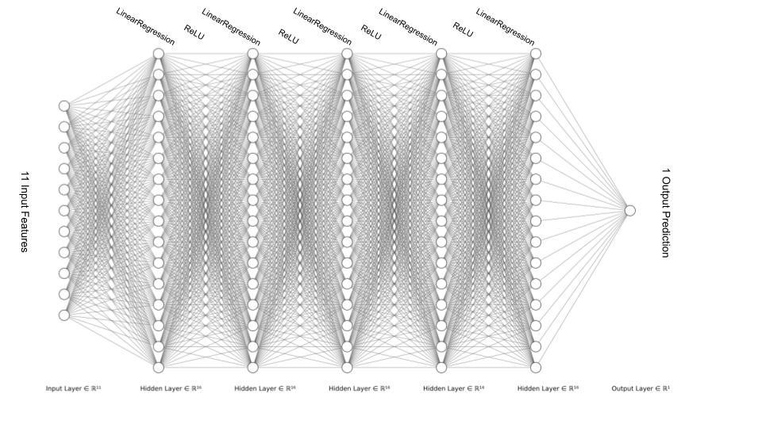

# Modelling Airbnb's Property Listing Dataset

## Description

In this project the challenge is to create several Machine Learning and Deep Learning models that are trained on data and fulfill functions relevant to the Airbnb application. Before reading the sections below regarding the training of ML and ANN models, please take a look at the Explorative Data Analysis that can be found in Airbnb_EDA.ipynb, which gives a better understanding of the dataset and the numerical and categorical data used for training.

Stack:

- Python
- Pandas
- Numpy 
- Sci-kit learn
- PyTorch

## Cleaning the Data

The original data is shown in the file "listing.csv" and requires some cleaning. The following actions are completed by passing the dataframe of the original file into the relevant functions of the DataCleaning() class shown in tabular_data.py

- Removing rows with missing ratings for any of the ratings columns
- Combining the list of strings in the description column into a single, clean string
- Setting the default value to one for any missing values in the guests, beds, bathrooms or bedrooms columns.

*Pre-processing*: In order to utilise the clean data for training, it is passed to the load_airbnb(df, labels) which returns a tuples in the format (features, labels) for each example in the dataset.

## Regression Models

The first challenge in this scenario is to find the best regression model that can fit the data - processed in the previous step - and predict the price per night of a listing, based on the different ratings and stats (e.g. number of bedrooms) for each listing. To do this we implement grid search. The file modelling.py contains a function that implements grid search from scratch (custom_tune_regression_model_hyperparameters()) and a second that makes use of the sci-kit learn GridSearchCV class (tune_regression_model_hyperparameters()).

We provide the function with a list of dictionaries, each specifying a model class for our regression model that we want to train, as well as a range of hyperparameters associated with the model. The function then goes through all possible hyperparameter configurations for each model and saves the model of each type to the provided directory. We then return the overall best model, hyperparameters and the performance metrics of the model.

The list of dictionaries used here can be found in the appendix below.

The find_best_model function goes through all the models in a specified directory and loads the best one.

*Note*: For consistancy, throughout the evaluation process, the Root Mean Squared Error (RMSE) for the validation dataset is used to compare model performance.

The best model found within the list above was of the RandomForestRegressor class.

With the hyperparameters:

- criterion: absolute error
- max depth: 20
- n_estimators: 200

And the performance metrics:

- Training RMSE: 38.08
- Validation RMSE: 24.46
- Test RMSE: 53.85
- Test R<sup>2</sup> : 0.91

One of the dangers of training ML models it overfitting, and some model classes are more prone to this than others. For example, in one of the earlier runs of the code, decision trees achieved a 0.0 validation RMSE, which is a strong indication that the model is overfitting. To counteract this, we introduce a minimum number of samples per leaf, which reduces the complexity of the generated tree. It is then harder for the algorithm to overfit. Ensemble models, for example random forest, also reduce the risk of overfitting further. Finally, another measure we can use is to increase the size of our dataset.

In our case the random forest ensemble model performed best. The training, validation and test RMSEs are not too far apart, which indicates the model does well at generalising. A good way to visualise this is by looking at the overlap of the real distribution of data compared to:


From the above, we can see that the model can predict to a larg degree the distribution of real datapoints, making a convincing case for its accuracy!

Next, let's look at classifying listings into the correct categories.


## Classification Models

As our next challenge, we aim to train a model that can predict the category of a listing using its various attributes. As there is a set list of categories available, this is a multiclass problem - therefore, requiring a classification model to solve. It's also important to note tha the categories have to be encoded using the LabelEncoder() provided by sklearn. This transforms the different classes into integers that can be passed into an array, rather than strings. The inverse_transform() method can be used to translate the predicet result back into the original class.

The grid search for obtaining the best model and corresponding hyperparamters can be done in a similar manner to the regression models mentioned above, with some tweaks to the existing functions. This includes making them more general so that, for example, they can take in different criterions to evaluate the trained models against. Above we used the RMSE of the validation set, which would not make much sense for a classification problem. Hence, we will be using the accuracy of the model to predict classes in the validation set as a metric in this section.

The list of dictionaries used can be found in the appendix below.

All of the best performing models for each model class were saved to the directory ./models/classification, along with their hyperparameters and performance metrics. The best performing model was another random forest ensemble model: RandomForestClassifier, with the following hyperparameters:

- criterion: log_loss
- max_depth: 20
- n_estimators: 150

The corresponding performance metrics are listed below:

F1 scores:

- f1_score_training: 0.99
- f1_score_validation: 1.0
- f1_score_test: 1.0

Precision scores:

- precision_score_training: 0.99
- precision_score_validation: 1.0
- precision_score_test: 1.0

Recall scores:

- recall_score_training: 0.99
- recall_score_validation: 1.0
- recall_score_test: 1.0

Accuracy scores:

- accuracy_score_training: 0.99
- accuracy_score_validation: 1.0
- accuracy_score_test: 1.0


We can see that the model scored very highly, which means we should be consious it might have overfitted the dataset. With classifiers, we can increase the number of k-folds used in cross-validation. The other points mentioned for regression models above also apply, especially increasing the size of the dataset.

A good way of visualising how well a model performs is by using a confusion matrix for each category. This type of graph shows the number of predictions made by the model that are true positives,false positives, true negatives and false negatives. You can see the confusion matrices for the best performing random forest model below.


Legend:

0 = Amazing pools; 
1 = Beachfront; 
2 = Chalets; 
3 = Offbeat; 
4 = Treehouses;

## ANN Regression Model

Finally, we are looking at training regression Artificial Neural Networks (ANNs) that can make predictions relevant to our dataset. To continue along the line of what is discussed in the Airbnb_EDA.ipynb notebook, we'll focus on the Price_Night, bedrooms and Accuracy_rating features. The file ann.py contains a framework that allows us to either train an ANN model with hyperparameters specified in a .yaml file or, alternatively can take a dictionary listing the various hyperparameters we'd like to test out. The script then calculates all the different combinations of hyperparameters, trains a model for each combination and saves the corresponding hyperparameters, performance metrics, the model itself and the associated tensorboard file to a local directory. The saved files are automatically named with timestamps.

Below you can see the dictionary of hyperparamters that was used for the experiments regarding the three features we're investigating:

```
hyperparameter_dict = {
        "optimiser": ["torch.optim.Adam", "torch.optim.SGD"],
        "learning_rate": [0.0005, 0.001, 0.0001],
        "hidden_layer_width": [16, 32, 128],
        "model_depth": [15, 30, 50],
        "n_epochs": [30]
    }
```

In this particular framework, the hiddenlayers are all the same size, for simplicity. You can find the architecture of the model trained to predict the price per night below:



*Note*: Due to spacing, the sketch only shows 5 hidden layers - in the actual model there are 50. Each layer is a linear regression layer and each layer uses a ReLU activation function.

To be consistent with the regression ML models in the section above, the validation RMSE was used to select the best performing model. You can find the performance metrics for the best model for each investigated feature below:

**Price per night**:

Criterion| Training Set | Validation Set | Test Set 
--- | --- | --- | --- 
RMSE| 129.802 | 92.759 | 99.490
R<sup>2</sup> score| -0.03 | -0.01 | -0.08

- Training duration (s): 6.74
- Inference latency (s): 2.6569


**Number of bedrooms**:

Criterion| Training Set | Validation Set | Test Set 
--- | --- | --- | --- 
RMSE| 0.416 | 0.381 | 0.481
R<sup>2</sup> score| 0.82 | 0.89 | 0.75

- Training duration (s): 196.94
- Inference latency (s): 0.0063


**Accuracy rating**:

Criterion| Training Set | Validation Set | Test Set 
--- | --- | --- | --- 
RMSE| 0.079 | 0.078 | 0.087
R<sup>2</sup> score| 0.60 | 0.56 | 0.67

- Training duration (s): 77.75
- Inference latency (s): 0.0008

**Tensorboard**

Price per night:


Number of bedrooms:


Accuracy rating:


The hyperparameters for each of the models above can be found int he appendix below. When taking a closer look at the perfomance stats, we can see that the last two perform fairly well, while the model for prediciting the price per night is not doing as well. What's particularly interesting is that the random forest regression model we trained earlier easily outperforms our neural network model. This is an important point to take that ANNs are not necessarily necessary or the best way to solve a problem.

When we think back to our initial investigation of the dataset, we remember that the data for the Price_Night variable was skewed and had a few outliers. We were able to amend this by removing the outliers from the data.

If we now train a model to predict the price per night with exactly the same hyperparameter settings as the best model we've trained so far for this task, we can see a drastic improvement!

The performance stats for the model without outliers are as follows:

**Price per night**:

Criterion| Training Set | Validation Set | Test Set 
--- | --- | --- | --- 
RMSE| 63.221 | 53.231 | 67.764
R<sup>2</sup> score| -0.02 | -0.01 | -0.01

- Training duration (s): 7.315
- Inference latency (s): 0.00005


However, we still can't beat the ML model from the first section.


## Apendix

### Regression

This is the list of models and hyperparameters that were evaluated:

```
    models_lst = [
        {
            "model_class": SGDRegressor,
            "dataset": (X,y),
            "hyperparameters_dict": {"loss": ["squared_error","huber", "epsilon_insensitive", "squared_epsilon_insensitive"],
                       "shuffle": [True, False]}
        },
        {
            "model_class": RandomForestRegressor,
            "dataset": (X, y),
            "hyperparameters_dict": {
                "n_estimators": [150, 200],
                "criterion": ["squared_error", "absolute_error", "friedman_mse"],
                "max_depth": [20, 50]
            }
        },
        {
            "model_class": GradientBoostingRegressor,
            "dataset": (X, y),
            "hyperparameters_dict": {
                "loss": ["squared_error", "absolute_error", "huber"],
                "learning_rate": [0.1, 0.2],
                "n_estimators": [150, 200]
            }
        },
        {
            "model_class": DecisionTreeRegressor,
            "dataset": (X, y),
            "hyperparameters_dict": {
                "criterion": ["squared_error", "absolute_error", "friedman_mse"],
                "max_depth": [20, 50],
                "splitter": ["best", "random"],
                "min_samples_leaf": [5, 10],
                "random_state": [15]
            }
        }
    ]
```

### Classification

This is the list of models and hyperparameters that were evaluated:

```
model_list = [
        {
            "model_class": RandomForestClassifier,
            "dataset": (X, y_transform),
            "hyperparameters_dict": {
                "n_estimators": [150, 200],
                "criterion": ["gini", "entropy", "log_loss"],
                "max_depth": [20, 50]
            }
        },
        {
            "model_class": GradientBoostingClassifier,
            "dataset": (X, y_transform),
            "hyperparameters_dict": {
                "loss": ["log_loss", "deviance", "exponential"],
                "learning_rate": [0.1, 0.2],
                "n_estimators": [150, 200]
            }
        },
        {
            "model_class": DecisionTreeClassifier,
            "dataset": (X, y_transform),
            "hyperparameters_dict": {
                "criterion": ["gini", "entropy", "log_loss"],
                "max_depth": [20, 50],
                "min_samples_split": [0.1, 0.15, 0.2]
            }
        },
        {   "model_class": LogisticRegression,
            "dataset": (X, y_transform),
            "hyperparameters_dict":{
                "penalty": ["l1", "l2", "elasticnet"],
                "dual": [True, False],
                "random_state": [0],
                "solver": ["lbfgs", "liblinear", "newton-cg"]
            }
        }
    ]

```

### ANN Regression

Price-per-night model hyperparameters:

- Optimiser: torch.optim.Adam
- Learning_rate: 0.0005
- Hidden_layer_width: 16
- Model_depth: 50
- N_epochs: 30

Number-of-bedrooms model hyperparameters:

- Optimiser: torch.optim.Adam
- Learning_rate: 0.0005
- Hidden_layer_width: 32
- Model_depth: 30
- N_epochs: 30

Accuracy-rating model hyperparameters:

- Optimiser: torch.optim.Adam
- Learning_rate: 0.001
- Hidden_layer_width: 128
- Model_depth: 15
- N_epochs: 30

